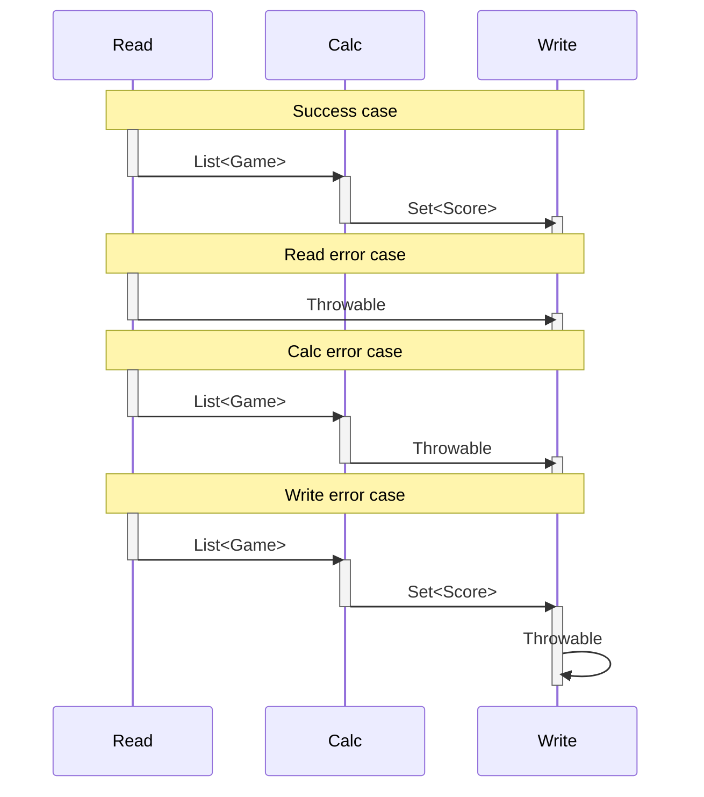

# Solution

It is a command line program accepting a single parameter with the path to the CSV files directory containing:
* The files with the players' stats in each game using this filename pattern: `<GAME_NAME>.players`
  * Their contents are the ones described in the [exercise](exercise.md) ([example](../src/test/resources/tournament1/PAINTBALL.players))
* The files with the games' points given in each game using this filename pattern: `<GAME_NAME>.points`
  * Their contents are: `position;win points;stat1 points;stat2 points;...` ([example](../src/test/resources/tournament1/PAINTBALL.points))

The program supports any number of games (files) and game stats (columns). The calculated scores are printed to STDOUT in JSON format so that they can be later processed by other programs. In the case of errors, they are printed to STDERR as JSON.

## Components

The process is divided into 3 stages: reading the games' data, computing the scores and writing them. Each stage has its own interface so that different implementations can be combined to provide different solutions, for instance: reading data in CSV format and writing the scores in HTML, or reading in JSON and inserting the scores in a DB, or using native code calls to calculate the scores, etc. There is a "runner" component that receives concrete stage implementations and chains them as follows:



---
📝️️ **NOTE:** To support different implementations apart from the default one based on a CSV input and a JSON output, **now** the command line program accepts an additional parameter to specify the class implementing the [`ScoreInterface`](../src/main/kotlin/apdlll/scores/model/ScoresInterfaces.kt):

```shell
./scores [--impl package.ImplClass] [impl params]
```

New implementations can be added to the `apdlll.scores.impl` package. By default, the program will use [`apdlll.scores.impl.def.ScoresDefaultImpl`](../src/main/kotlin/apdlll/scores/impl/def/ScoresDefaultImpl.kt):

```shell
./scores --impl apdlll.scores.impl.def.ScoresDefaultImpl [csv-files-dir]
./scores [csv-files-dir] # same as previous command
./scores # uses "src/test/resources/tournament1" dir by default
```

---

## Implementation

The default implementation of the [`ReadInterface`](../src/main/kotlin/apdlll/scores/impl/def/CsvFilesReadImpl.kt) and [`WriteInterface`](../src/main/kotlin/apdlll/scores/impl/def/StdOutJsonWriteImpl.kt) can be easily done using a CSV library to read the games' data and a JSON library to write the scores, but in this project no external dependencies are used, so specialized [CSV readers](../src/main/kotlin/apdlll/scores/reader/csv) for games and some [JSON write functions](../src/main/kotlin/apdlll/scores/writer/JsonWriteExtensions.kt) for scores and errors have been added.

<details>
  <summary>This is the model used to hold the data exchanged between the read, calc and write interfaces...</summary>

```kotlin
data class Player(val name: String, val team: String,
                  val stats: List<Int>, val statsPoints: List<Int>, val winPoints: Int)
data class Game  (val name: String, val players: Set<Player>,
                  val lowestTeamScoreWins: Boolean, val teamScoreStatIndex: Int)
data class Score (val player: String, val points: Int)
```

</details>

The logic calculating the scores basically maps pairs of `<player name, game score>` and aggregates the scores by player. There is a dependency between the player final game score and the extra points given to game winners. That interdependency can be removed if the logic calculating the winners emits their own pairs `<winner player name, win points>` and then aggregate them together with the pairs emitted by the other logic calculating the player personal score. That might be useful in a distributed processing scenario, but for a single CPU solution it is simpler to (1st) obtain the winner team and (2nd) compute the players' score adding the extra points if played for that team. The top-down division of the work is:

1. A function to emit players' scores from all games and aggregate them by player's name
2. A function to calculate the player personal score (for 1)
3. A function to obtain the winner team of a game (for 2)
4. A function to compute teams scores in the game (for 3)
5. A function to obtain the player contribution to the team score (for 4)

<details>
  <summary>This is the implementation of the previous functions...</summary>

```kotlin
fun getPlayerTeamScore(player: Player, game: Game) =
  player.stats[game.teamScoreStatIndex].run { if (game.lowestTeamScoreWins) unaryMinus() else this }

fun getTeamsScores(game: Game) = game.players.fold(mutableMapOf<String, Int>()) { acc, player ->
  acc.compute(player.team) { _, points -> (points ?: 0) + getPlayerTeamScore(player, game) }.run { acc }
}

fun getWinnerTeam(game: Game) = getTeamsScores(game).entries.fold(null as String? to Int.MIN_VALUE) {
  acc, teamScore ->
    if (acc.second < teamScore.value) teamScore.toPair()
    else if (acc.second == teamScore.value) null to teamScore.value
    else acc
}.first

fun getPlayerPersonalScore(player: Player, winnerTeam: String?) =
  player.stats.mapIndexed {
      index, statValue -> statValue * player.statsPoints[index]
  }.reduce {
      acc, score -> acc + score
  }.plus(if (player.team == winnerTeam) player.winPoints else 0)

operator fun Score.plus(other: Score?) = copy(points = this.points + (other?.points ?: 0))

fun calculateScores(gamesData: List<Game>) = gamesData.flatMap { game ->
  val winnerTeam = getWinnerTeam(game)
  game.players.map { player -> Score(player.name, getPlayerPersonalScore(player, winnerTeam)) }
}.fold(mutableMapOf<String, Score>()) {
  acc, score -> acc.compute(score.player) { _, totalScore -> score + totalScore }.run { acc }
}.values.toSet()
```
</details>

<details>
  <summary>This is a test using the exercise's description samples, and you can run it online in the <a href="https://pl.kotl.in/Uij68uwer" target="_blank">Kotlin playground</a>...</summary>

```kotlin
val paintballWinPoints = 10
// Paintball stats: flags captured, kills, deaths
val backPoints  = listOf(3, 1, -3)
val midPoints   = listOf(2, 2, -2)
val frontPoints = listOf(1, 3, -1)
val paintballPlayers = setOf(
  Player("Tyrion", "Lannister", listOf( 0, 5, 4), backPoints , paintballWinPoints),
  Player("Bronn" , "Lannister", listOf( 0, 8, 3), midPoints  , paintballWinPoints),
  Player("Jaime" , "Lannister", listOf(10, 4, 7), frontPoints, paintballWinPoints),
  Player("Varys" , "Stark"    , listOf( 0, 5, 2), backPoints , paintballWinPoints),
  Player("Hodor" , "Stark"    , listOf( 2, 7, 8), midPoints  , paintballWinPoints),
  Player("Arya"  , "Stark"    , listOf(10, 2, 7), frontPoints, paintballWinPoints))

val kartingWinPoints = 1
// Karting stats: finish position, positions gained, fastest laps
val fastPoints   = listOf(-3, 1, 1)
val normalPoints = listOf(-2, 1, 2)
val slowPoints   = listOf(-1, 1, 3)
val kartingPlayers = setOf(
  Player("Tyrion", "Lannister", listOf(1,  0, 15), fastPoints  , kartingWinPoints),
  Player("Jaime" , "Lannister", listOf(3, -1,  1), normalPoints, kartingWinPoints),
  Player("Varys" , "Lannister", listOf(6, -1,  0), slowPoints  , kartingWinPoints),
  Player("Arya"  , "Stark"    , listOf(2,  1,  4), fastPoints  , kartingWinPoints),
  Player("Bronn" , "Stark"    , listOf(4,  0,  0), normalPoints, kartingWinPoints),
  Player("Hodor" , "Stark"    , listOf(5,  1,  0), slowPoints  , kartingWinPoints))

val games = listOf(
  Game("Paintball", paintballPlayers, false, 0),
  Game("Karting"  , kartingPlayers  , true , 0))

println(calculateScores(games).sortedBy { it.points }.joinToString(System.lineSeparator()))
```
</details>
